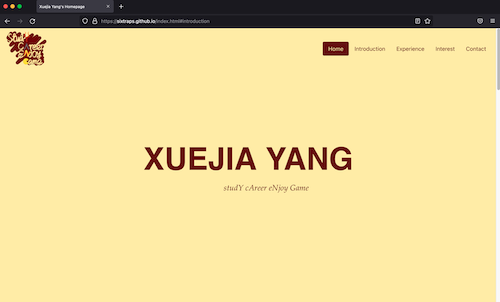

Project name: Xuejia Yang's very first Personal Homepage

Author: Xuejia Yang https://sixtraps.github.io

Class Link: https://johnguerra.co/lectures/webDevelopment_fall2021/

Project Objective:
Building this homepage has several objectives. To start with, it would be great to have my own homepage, introducing my experiences, achievements,
hobbies, and others to people who are interested. I do not have a homepage before and this project fills the blank. Secondly, a personal homepage
is perfect for me to practice web programming using html, css, and javascript as a starter. Through the webpage building process, I really find
myself getting familier with basic html elements, arrangement among different elements, and how to use javascript to create interactions. I took
references from a template (http://www.mobanwang.com/mb/202010/17906.html) and studied its art style. Then I built this homepage from scratch. It
was a meaningful learning process.

Screenshot: 

Instruction to build:
Anyone who are in need can use my homepage as a template. I will continuously update this project as my understanding towards web programming
progressing.
To use this project, git everything to your local drive first. Then, you can get in the saving directory in your terminal. Next, use command:
`npm install` to install all required dependencies. Finally, you can use kits like http-server or reload in your terminal to run the homepage
in your local network.

Features of this webpage:

1. The main page consists of four parts: home, introduction, experience, and interest. These sections are listed on the navigation bar on the top
   right corner. Clicking the buttons will navigate you to respective location automatically.
2. The contact page is separated from the others.
3. I used animated-headline library to add some animation effects. For example, mottos under my name are changed from one to another from time to
   time. In the interest section, I also adapted animations to show my different interests so as to make the webpage tidier.
4. A "back-to-top" button was placed at the bottom right corner. It was hidden initially. If you scroll down the page for a bit, it will fade in
   and show itself. Clicking this button will navigate you to the top of the webpage.

Video demonstration:
